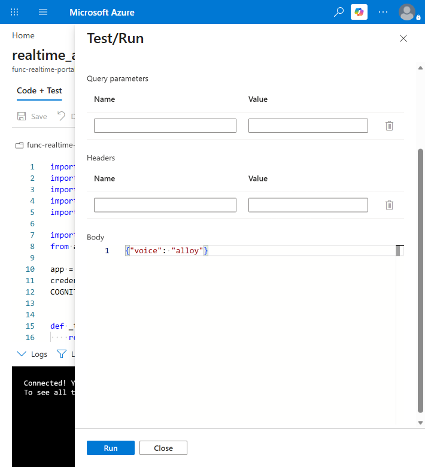

# はじめての Azure Functions デプロイ手順

このドキュメントでは、Azure Portal の画面を使って Azure Functions を作成し、このリポジトリの Python コードをデプロイします。Azure を初めて使う方でも進められるように、1 つずつ順番に説明します。

## このアプリでできること

ブラウザーのデモ画面から Azure OpenAI の音声機能を使うとき、ブラウザーが直接 Azure OpenAI を呼び出すのは安全ではありません。そこで、次の役割分担にします。

1. ブラウザーは Azure Functions を呼び出します。
2. Azure Functions が Azure OpenAI に問い合わせて、短時間だけ有効なトークンを取得します。
3. ブラウザーはそのトークンを使って音声セッションを開始します。

この構成であれば、Azure OpenAI のキーをサーバー側だけに保存できます。


## 作成するもの

| リソース | 役割 |
| --- | --- |
| Azure Functions | ブラウザーから呼び出される API |
| ストレージ アカウント | Azure Functions の動作に必要な保存領域 |
| Azure OpenAI | 音声モデルを提供するサービス |

## 準備するもの

- Azure サブスクリプション
- Azure OpenAI リソースと、作成済みの Realtime モデル デプロイ
- このリポジトリをダウンロードした Windows PC

PC には次のツールをインストールします。

- Python
- Azure Functions Core Tools v4

インストール後、PowerShell を開いて確認します。バージョン番号が表示されれば成功です。

```powershell
python --version
func --version
```


## 手順 1. Azure OpenAI の情報をメモする

Azure Portal で Azure OpenAI リソースを開き、左メニューの **キーとエンドポイント** を選択します。ここから次の 3 つを控えます。

| 必要な情報 | 取得場所 | 例 |
| --- | --- | --- |
| エンドポイント | **キーとエンドポイント** | `https://contoso.openai.azure.com` |
| キー | **キーとエンドポイント** のキー 1 | 文字列（秘密の値） |
| デプロイ名 | **モデル デプロイ** の一覧 | `gpt-realtime-2.1-mini` |

デプロイ名は「モデルの名前」ではなく、自分で付けた**デプロイの名前**です。この後の設定で使います。


> [!WARNING]
> キーはパスワードと同じです。メール、チャット、スクリーンショット、HTML ファイルに貼り付けないでください。誤って共有した場合は、同じ画面からキーを再生成します。

## 手順 2. ストレージ アカウントを作成する

Azure Functions は動作するために保存領域を必要とします。

1. Azure Portal の検索ボックスに「ストレージ アカウント」と入力し、開きます。
2. **作成** を選択します。
3. サブスクリプションとリソース グループを選びます。リソース グループがなければ **新規作成** を選びます。
4. ストレージ アカウント名を入力します。名前は全体で一意である必要があります。
5. リージョンを選びます。
6. 他は既定のままで **確認と作成** を選び、**作成** を選択します。

作成が完了したら、そのストレージ アカウントを開き、**セキュリティとネットワーク** の **アクセス キー** を選択します。**接続文字列** の **表示** を選び、値をコピーしてメモしておきます。


## 手順 3. Function App を作成する

1. Azure Portal の検索ボックスに「Function App」と入力し、開きます。
2. **作成** を選択します。
3. **基本** タブで次のように設定します。

| 項目 | 設定内容 |
| --- | --- |
| サブスクリプション | 手順 2 と同じもの |
| リソース グループ | 手順 2 と同じもの |
| Function App 名 | 一意の名前（この名前が URL になります） |
| 公開 | コード |
| ランタイム スタック | Python |
| バージョン | 表示される最新のバージョン |
| オペレーティング システム | Linux |
| リージョン | 手順 2 と同じリージョン |

4. **ストレージ** タブで、手順 2 で作成したストレージ アカウントを選びます。
5. **監視** タブでは、Application Insights を **はい** のままにしておくと、後でエラーを確認しやすくなります。
6. **確認と作成** を選び、**作成** を選択します。

デプロイ完了まで数分かかります。完了したら **リソースに移動** を選択します。


## 手順 4. アプリケーション設定を登録する

アプリが Azure OpenAI に接続するための情報を登録します。

1. 作成した Function App を開きます。
2. 左メニューの **設定** から **環境変数** を選択します。
3. **アプリ設定** タブで **追加** を選び、次の 4 つを登録します。

| 名前 | 値 |
| --- | --- |
| `AzureWebJobsStorage` | 手順 2 でコピーした接続文字列 |
| `AOAI_ENDPOINT` | 手順 1 のエンドポイント |
| `AOAI_REALTIME_DEPLOYMENT` | 手順 1 のデプロイ名 |
| `AOAI_API_KEY` | 手順 1 のキー |

4. **適用** を選んで保存します。
5. 左メニューの **概要** を開き、**再起動** を選択します。

名前は大文字と小文字を区別します。表のとおりに入力してください。


## 手順 5. PC で準備する

PowerShell を開き、ダウンロードしたリポジトリのフォルダーに移動します。`api` フォルダーで、必要なライブラリをインストールします。

```powershell
cd api
python -m venv .venv
.\.venv\Scripts\Activate.ps1
python -m pip install -r requirements.txt
```

`.venv` は、このプロジェクト専用の Python 環境です。作成後は行の先頭に `(.venv)` と表示されます。


## 手順 6. コードをデプロイする

`api` フォルダーのまま、次のコマンドを実行します。`<function-app-name>` は手順 3 で付けた名前に置き換えます。

```powershell
func azure functionapp publish <function-app-name>
```

初回はサインインを求められることがあります。ブラウザーが開いたら、Azure Portal と同じアカウントでサインインします。

完了すると、デプロイされた関数の一覧と URL が表示されます。


Azure Portal 側でも確認できます。Function App を開き、左メニューの **関数** に `realtime-access` が表示されていれば成功です。

## 手順 7. API の URL とキーを取得する

ブラウザーのデモ画面には、API の URL と関数キーを入力します。

1. Function App の **関数** から `realtime-access` を選択します。
2. **関数キー** を開きます。
3. `default` のキーの値をコピーします。

API の URL は次の形になります。

```text
https://<function-app-name>.azurewebsites.net/api/realtime-access
```


ここでコピーするのは Azure Functions のキーです。手順 1 の Azure OpenAI のキーとは別のものです。Azure OpenAI のキーをブラウザーに入力してはいけません。

## 手順 8. Web 画面からの呼び出しを許可する

ブラウザーは、許可されていない場所からの通信をブロックします。デモ画面を Azure でホストしている場合は、その URL を許可リストに追加します。

1. Function App の **API** から **CORS** を選択します。
2. **許可されたオリジン** に、デモ画面の URL を追加します。

```text
https://<site-name>.azurestaticapps.net
```

3. **保存** を選択します。

末尾にスラッシュやページ名は付けません。`https://` から始まるドメイン部分だけを入力します。


## 手順 9. 動作を確認する

まず Azure Portal だけで確認できます。

1. Function App の **関数** から `realtime-access` を選択します。
2. **テストと実行** を選択します。
3. **本文** に次の内容を入力します。

```json
{
  "voice": "alloy"
}
```

4. **実行** を選択します。

応答に `ephemeral_token` と `webrtc_url` が含まれていれば成功です。



次にブラウザーのデモ画面を開き、手順 7 の URL とキーを入力します。マイクの使用を許可すると、音声セッションを開始できます。


## うまくいかないときは

| 表示される内容 | 確認すること |
| --- | --- |
| `Failed to authenticate with Azure OpenAI` | 手順 4 の `AOAI_API_KEY` が登録されているか、保存後に再起動したかを確認します。 |
| 401 または 403 のエラー | Azure OpenAI のキーが正しいか確認します。キーを再生成した場合は、手順 4 の値も更新します。 |
| 404 のエラー | `AOAI_ENDPOINT` と `AOAI_REALTIME_DEPLOYMENT` を確認します。デプロイ名の入力間違いが多い箇所です。 |
| ブラウザーで CORS のエラー | 手順 8 の URL が正しいか確認します。 |
| ブラウザーで 401 のエラー | 手順 7 の URL と関数キーを確認します。 |
| 関数が起動しない | `AzureWebJobsStorage` の接続文字列が正しいか確認します。 |

エラーの詳細は、Function App の **監視** から確認できます。

## 覚えておきたいこと

- Azure OpenAI のキーは、Function App のアプリケーション設定にだけ保存します。
- ブラウザーに入力するのは、Azure Functions の URL と関数キーだけです。
- キーはコードやスクリーンショットに含めません。
- CORS では、必要な URL だけを許可します。
