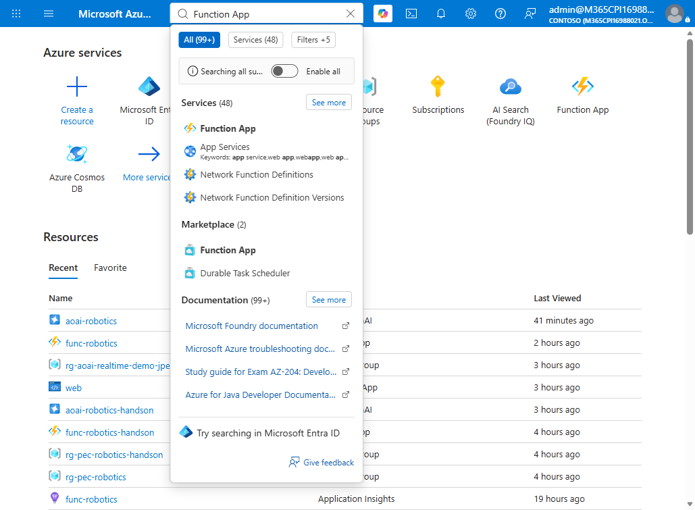
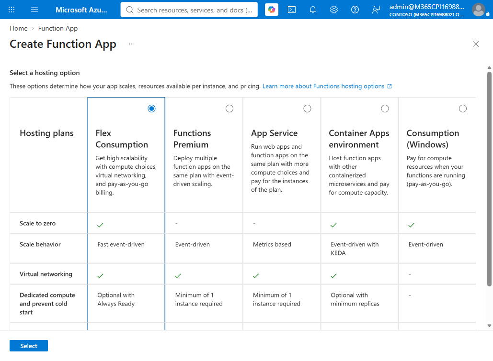
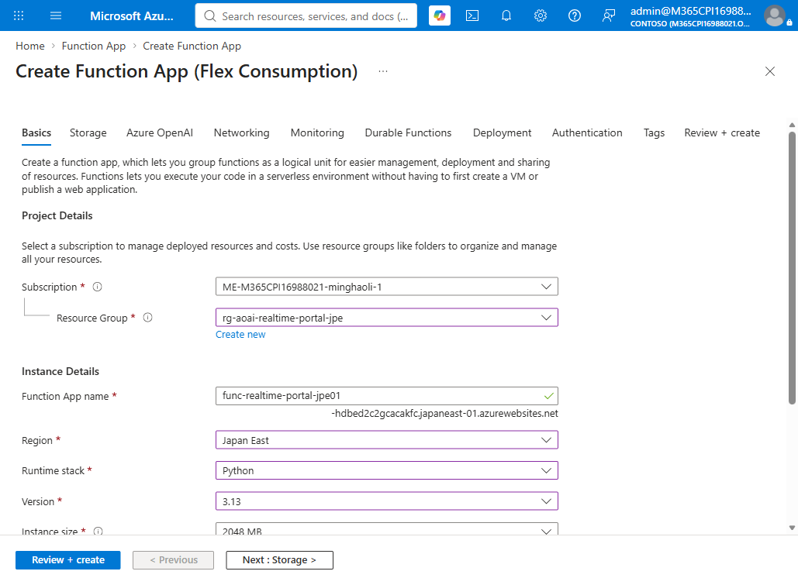
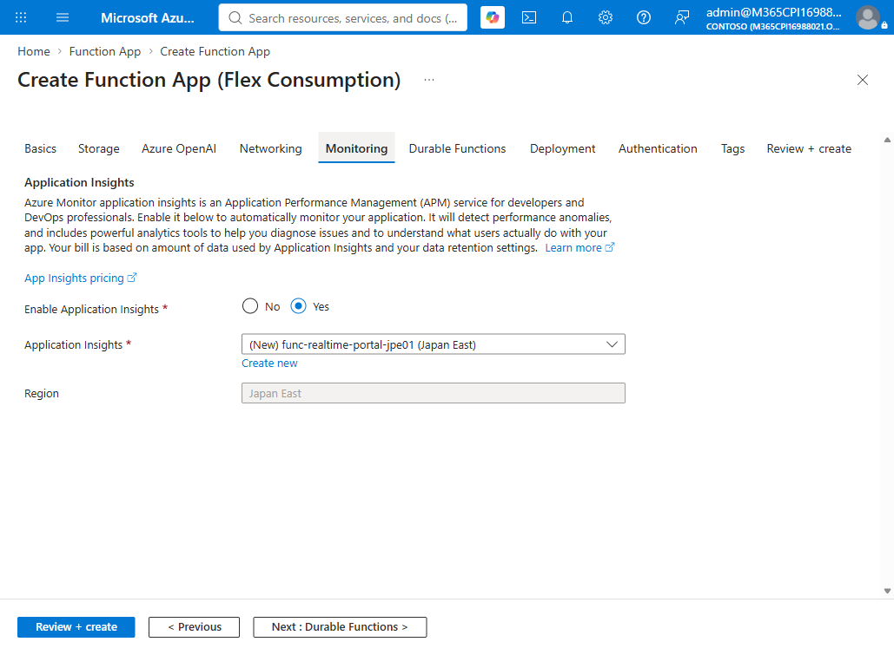
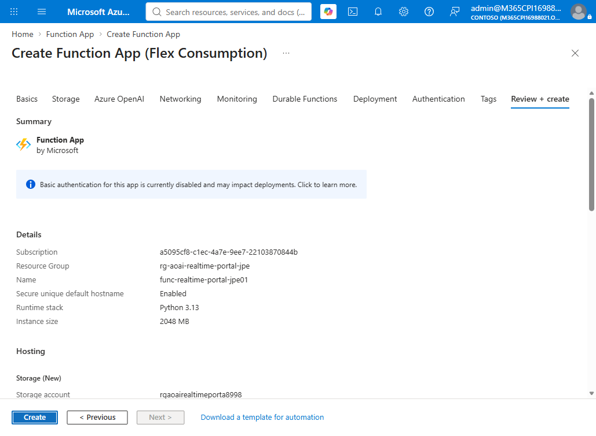
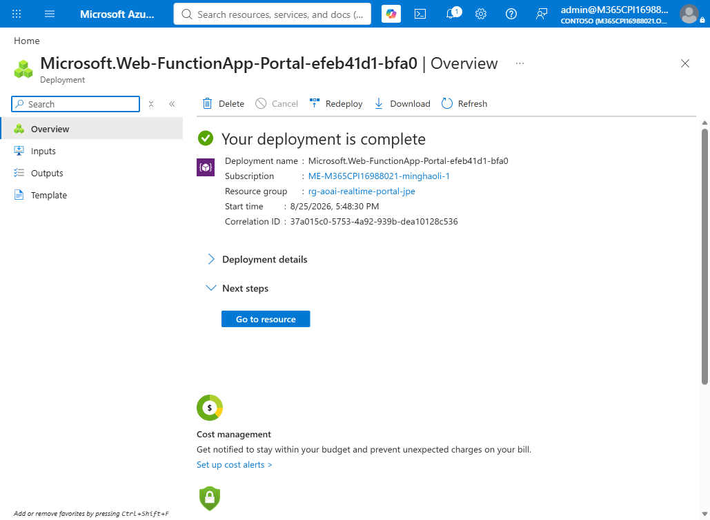
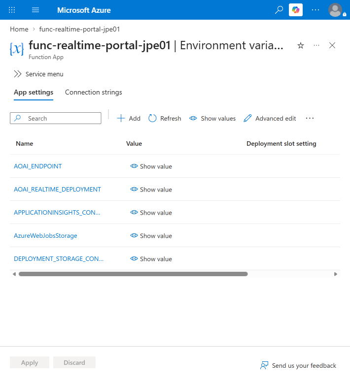
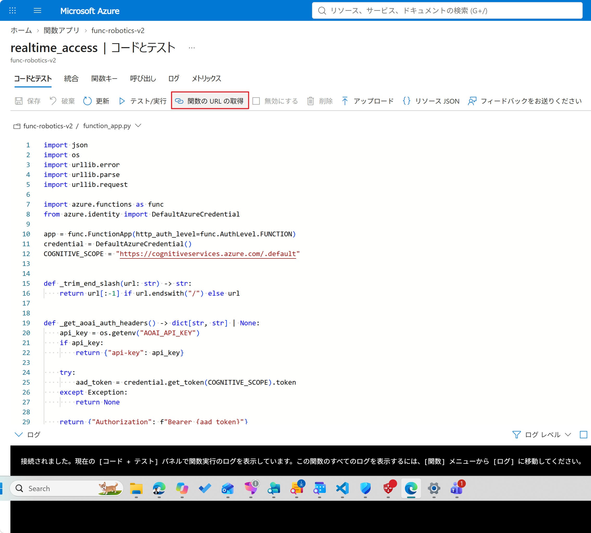
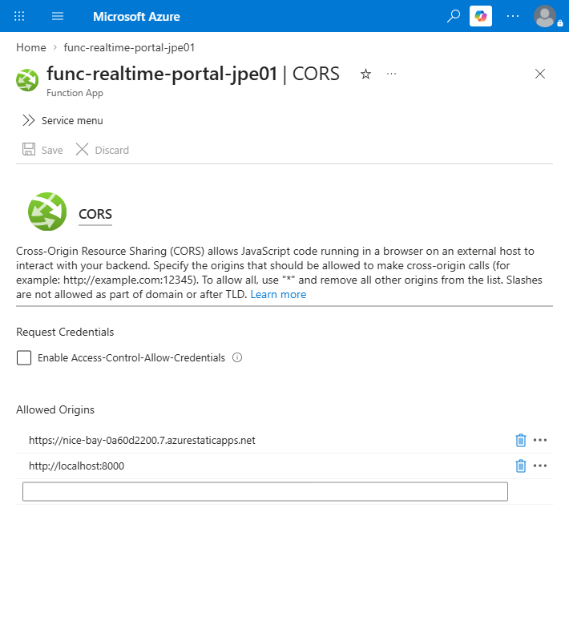
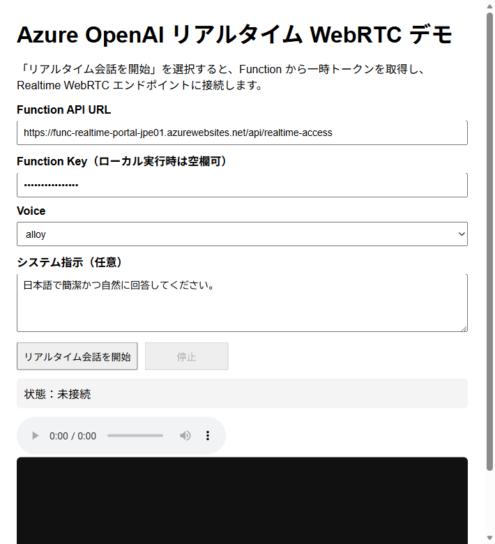

# はじめての Azure Functions デプロイ手順

このドキュメントでは、Azure Portal の画面を使って Azure Functions を作成し、このリポジトリの Python コードをデプロイします。Azure を初めて使う方でも進められるように、1 つずつ順番に説明します。

**既存 Function を更新する場合:** リソースを作り直さず、手順4/5の Azure Functions Core Tools で `api` の最新版を既存 Function App に公開してください。手順2の新規作成は省略し、手順3は既存設定の確認に使います。既存のマネージド ID 認証を、コード更新だけを理由に API key 方式へ変更する必要はありません。保持するデモの `func-robotics-v2` は Python 3.13・システム割り当てマネージド ID です。

**今回の役割分担:** トークン発行は Python Function のみ、App Service はページとブラウザー WebSocket relay のみです。2026年9月16日に本番公開と強化した公開後の3ページ音声受入試験が合格しました。実 Function トークンを使い、実入力の `input_audio_buffer.committed` 後に作成された応答の completed・音声受信、資格情報分離、Stop cleanup を全ページで確認しています。地図 / WebSocket の mini-transcribe は空でない入力 ASR 完了も合格しました。livevoice は入力 ASR を有効化していません。詳細は [README](../README.md) を参照してください。

## 作成するもの

| リソース              | 役割                                               |
| --------------------- | -------------------------------------------------- |
| Azure Functions       | ブラウザーから呼び出される API                     |
| ストレージ アカウント | Azure Functions の動作に必要な保存領域（自動作成） |
| Application Insights  | 実行ログとエラーの確認（自動作成）                 |
| Azure OpenAI          | 音声モデルを提供するサービス                       |

## 準備するもの

- Azure サブスクリプション
- Azure OpenAI リソースと、作成済みの Realtime モデル デプロイ
- このリポジトリをダウンロードした Windows PC

PC には次のツールをインストールします。

- Python 3.13（Function App と同じバージョンを推奨）
- Azure Functions Core Tools v4

インストール後、PowerShell を開いて確認します。バージョン番号が表示されれば成功です。

```powershell
python --version
func --version
```

## 手順 1. Azure OpenAI の情報をメモする

Azure Portal で Azure OpenAI リソースを開き、次の 3 つを控えます。

| 必要な情報     | 取得場所                                                 | 例                                   |
| -------------- | -------------------------------------------------------- | ------------------------------------ |
| エンドポイント | **リソース管理** の **キーとエンドポイント** | `https://contoso.openai.azure.com` |
| API キー       | **リソース管理** の **キーとエンドポイント** | `キー 1` の値                      |
| デプロイ名     | **モデル デプロイ** の一覧                         | `gpt-realtime-2.1-mini`            |

API キーは **キーとエンドポイント** の画面で **表示** を選択すると確認できます。`キー 1` と `キー 2` のどちらを使っても問題ありません。コピー アイコンで値を控えておきます。

デプロイ名は「モデルの名前」ではなく、自分で付けた**デプロイの名前**です。この後の設定で使います。

API キーはパスワードと同じです。コードやスクリーンショットに含めず、他の人と共有しないでください。

## 手順 2. Function App を作成する

1. Azure Portal の検索ボックスに「Function App」と入力し、開きます。



2. **作成** を選択します。
3. ホスティング プランの選択画面で **フレックス従量課金** を選択します。



4. **基本** タブで次のように設定します。

| 項目                | 設定内容                   |
| ------------------- | -------------------------- |
| サブスクリプション  | 使用するサブスクリプション |
| リソース グループ   | 使用するリソース グループ  |
| Function App 名     | Azure 内で一意の名前       |
| リージョン          | Japan East                 |
| ランタイム スタック | Python                     |
| バージョン          | Python 3.13                |
| インスタンス サイズ | 2048 MB                    |



5. **ストレージ** タブでは、ストレージ アカウントを手動で作成せず、既定の自動作成を使用します。

※ すでにストレージ アカウントを用意している場合は、既存のものを使用してください。

6. **監視** タブでは、Application Insights を **はい** のままにしておくと、後でエラーを確認しやすくなります。

※ **Application Insights を有効にする** がグレーアウトされている場合は、選択した **リージョン** または **ランタイム スタック** がサポートされていないか、権限が不足している可能性があります。その場合は **いいえ** のまま進めても問題ありません。この設定は作成後にも変更できます。



7. その他の設定は変更不要です。**確認と作成**、**作成** の順に選択します。



デプロイ完了まで数分かかります。完了したら **リソースに移動** を選択します。



## 手順 3. アプリケーション設定を登録する

アプリが Azure OpenAI に接続するための情報を登録します。

1. 作成した Function App を開きます。
2. 左メニューの **設定** から **環境変数** を選択します。
3. `AzureWebJobsStorage` が自動設定されていることを確認します。この値は変更しません。
4. **追加** を選び、次の 3 つを登録します。

| 名前                         | 値                      |
| ---------------------------- | ----------------------- |
| `AOAI_ENDPOINT`            | 手順 1 のエンドポイント |
| `AOAI_API_KEY`             | 手順 1 の API キー      |
| `AOAI_REALTIME_DEPLOYMENT` | 手順 1 のデプロイ名     |

5. **適用** を選んで保存します。
6. 左メニューの **概要** を開き、**再起動** を選択します。

名前は大文字と小文字を区別します。表のとおりに入力してください。

`AOAI_API_KEY` はアプリケーション設定にのみ保存します。ブラウザーのデモ画面には入力しません。

既存のマネージド ID 構成では `AOAI_API_KEY` を追加せず、既存の ID と Azure OpenAI への権限を確認します。上表の API key 設定は、キー方式を採用する場合の説明です。



## 手順 4. PC で準備する

PowerShell を開き、ダウンロードしたリポジトリのフォルダーに移動します。`api` フォルダーで、必要なライブラリをインストールします。

```powershell
cd api
python -m venv .venv
.\.venv\Scripts\Activate.ps1
python -m pip install -r requirements.txt
```

`.venv` は、このプロジェクト専用の Python 環境です。作成後は行の先頭に `(.venv)` と表示されます。

## 手順 5. コードをデプロイする

`api` フォルダーのまま、次のコマンドを実行します。`<function-app-name>` は手順 2 で付けた名前に置き換えます。

```powershell
func azure functionapp publish <function-app-name>
```

初回はサインインを求められることがあります。ブラウザーが開いたら、Azure Portal と同じアカウントでサインインします。

完了すると、デプロイされた関数の一覧と URL が表示されます。

Azure Portal 側でも確認できます。Function App を開き、左メニューの **関数** に `realtime_access` が表示されていれば成功です。

## 手順 6. API の URL とキーを取得する

ブラウザーのデモ画面には、API の URL と関数キーを入力します。

1. Function App の **関数** から `realtime_access` を選択します。
2. 上部の **関数の URL の取得** を選択します。
3. キーで `default (Function key)` を選び、表示された URL をコピーします。
4. コピーした URL の `?code=` より前を **Function API URL**、後ろを **Function Key** として使用します。

Flex Consumption では、既定のホスト名に一意の文字列が付くことがあります。Function App 名から URL を組み立てず、Portal に表示された実際の URL を必ずコピーしてください。



ここでコピーする Function Key は、ブラウザーから Function App を呼び出すためのキーです。手順 1 の Azure OpenAI の API キーとは別のものなので、混同しないでください。

## 手順 7. Web 画面からの呼び出しを許可する

手順7/8は**ブラウザーの WebRTC デモ**の手順です。Python から Azure へ直接 WebSocket 接続する場合、ブラウザー CORS やローカル Web サーバーは不要です。[開発者向けコードガイド](developer-code-guide-ja.md) の直接接続手順を参照してください。

ブラウザーは、許可されていない場所からの通信をブロックします。デモ画面を表示する場所（オリジン）を許可リストに追加します。

まず、デモ画面を表示する方法を決めます。手軽に試す場合は、PC でローカル サーバーを起動します。`webapp` フォルダーで次のコマンドを実行します。

```powershell
cd ..\webapp
python -m http.server 8000
```

この場合のオリジンは `http://localhost:8000` です。デモ画面は `http://localhost:8000/gpt-realtime-livevoice-demo.html` で開きます。Azure Static Web Apps などで公開している場合は、その公開 URL がオリジンになります。

次に、Function App 側で許可します。

1. Function App の **API** から **CORS** を選択します。
2. **許可されたオリジン** に、上で決めたオリジンを追加します。

```text
http://localhost:8000
```

3. **保存** を選択します。

既存の許可値は削除せず、必要なオリジンを追記してください。保持する F1 サイトの場合は `https://app-realtime-f1-mh0922.azurewebsites.net` を追加します。ブラウザーは App Service 経由ではなく Function に直接 POST します。



末尾にスラッシュやページ名は付けません。`http://` または `https://` から始まるドメイン部分（ポート番号があれば含む）だけを入力します。

## 手順 8. 動作を確認する

ブラウザーのデモ画面を開き、**Function API URL** と **Function Key** に手順 6 の値を入力します。マイクの使用を許可すると、音声セッションを開始できます。

Node ホスト上の3ページは `/api/demo-config` から Function URL の編集可能な既定値を読み込みます。この手順の静的ローカルサーバーでは手動入力します。WebRTC は **Function key のみ**を使用します。別の WebSocket デモ画面では relay 専用の Demo key も必要ですが、Function key は relay に、Demo key は Function に送信しません。旧 App Service `/api/realtime-access` は410で廃止され、リダイレクトされません。



## うまくいかないときは

| 表示される内容                   | 確認すること                                                                                                           |
| -------------------------------- | ---------------------------------------------------------------------------------------------------------------------- |
| 必須の環境変数がないというエラー | 手順 3 の 3 つの設定が登録されているか、保存後に再起動したかを確認します。                                             |
| 401 または 403 のエラー          | `AOAI_API_KEY` の値が手順 1 でコピーしたキーと一致しているか確認します。キーを再生成した場合は新しい値に更新します。 |
| 404 のエラー                     | `AOAI_ENDPOINT` と `AOAI_REALTIME_DEPLOYMENT` を確認します。デプロイ名の入力間違いが多い箇所です。                 |
| ブラウザーで CORS のエラー       | 手順 7 の URL が正しいか確認します。                                                                                   |
| ブラウザーで 401 のエラー        | 手順 6 の URL と関数キーを確認します。                                                                                 |
| 関数が起動しない                 | Function App 作成時にストレージ アカウントが自動作成されたか確認します。                                               |

エラーの詳細は、Function App の **監視** から確認できます。

## 覚えておきたいこと

- Azure OpenAI の API キーは Function App のアプリケーション設定にだけ保存し、ブラウザーには渡しません。
- ブラウザーに入力するのは、Azure Functions の URL と関数キーだけです。
- キーはコードやスクリーンショットに含めません。
- CORS では、必要な URL だけを許可します。
